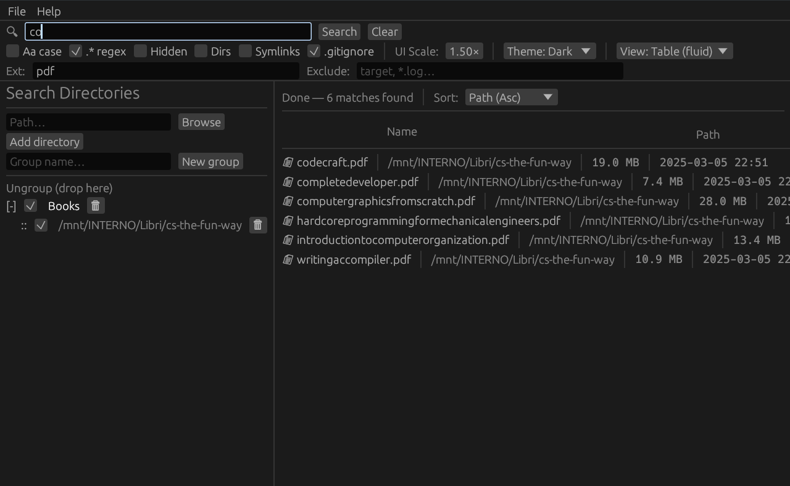

# fdthing
A graphical file finder, on top of fd

## Features
- Multiple directories search
- Group directories
- Case in/sensitive search
- Regex search
- Directories only search
- Extensions filter e.g. pdf, epub, azw3
- Exclude patterns e.g. **/folder, .epub

## Screenshot

## Download
[Linux](https://github.com/plucafs/fdthing/releases/download/v0.1.0/fdthing-linux)

## Credits
[fd](https://github.com/sharkdp/fd)
[pi](https://github.com/earendil-works/pi)
[OpenCode](https://github.com/anomalyco/opencode)

## License
MIT